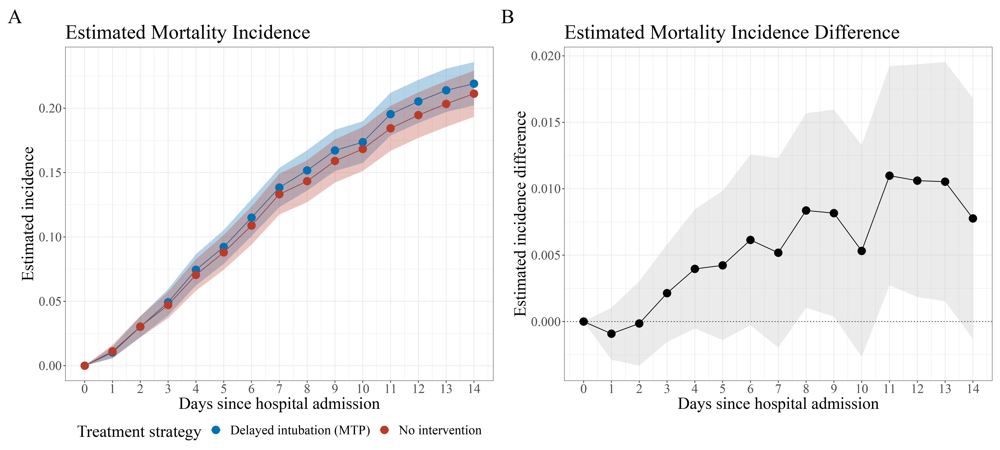

# Longitudinal Modified Treatment Policies (LMTPs): A unified framework for studying complex exposures
## Corresponding code guide for [Hoffman et al. (2023)]()

This repository demonstrates the use of the open-source R package [`lmtp`]() to estimate the effects of delaying intubation on mortality in a cohort of hospitalized COVID-19 patients during Spring 2020, as described in [Hoffman et al. (2023)]().

### What are LMTPs?

Longitudinal Modified Treatment Policies (LMTPs) are a recently developed methodology for causal inference ([Diaz et al. (2021)](https://arxiv.org/pdf/2006.01366.pdf)). LMTPs generalize many commonly used parameters for causal inference including average treatment effects, and facilitate the mathematical formalization, identification, and estimation of many
novel parameters. LMTPs apply to a wide variety of exposures, including binary, multivariate, and continuous, as well as exposures that result in practical violations of the positivity assumption. LMTPs can accommodate time-varying treatments and confounders, competing risks, loss-to-follow-up, as well as survival, binary, or continuous outcomes. 

### About the application

[Hoffman et al.]() provides numerous examples of types of research questions which can be answered within the proposed framework, and then goes into more depth with one of these examples---specifically, estimating the effect of delaying intubation on critically ill COVID-19 patients' mortality. The study design is retrospective and uses electronic health records of 3,059 patients hospitalized with COVID-19 at New York Presbyterian hospital between March 1 and May 15, 2020. The exposure is categorical and time-varying, and the outcome is also time-to-event with informative right-censoring. Adjustment set includes dozens of baseline and time-varying confounders. The estimator is a sequentially doubly robust (SDR) estimator which utilizes regressions for the exposure and outcome. These exposure and outcome regressions utilized a superlearner ensemble of flexible machine learning regressions.

## Repository contents

### Main scripts: 

- `R/run_lmtp.R` - main analysis script. sets up exposure, confounders, outcome, and runs `lmtp_sdr()` for an intervention and null intervention for all time points in the study.
- `R/clean_results.R` - summarizes LMTP results. checks density ratios, and creates graphs of output.

### Supporting scripts: 

- `R/vis.R` contains data visualization functions to plot incidence and incidence differences over time
- `R/utils.R` contains helper functions to clean results and summarize analyses (e.g. create marginal / simultaneous confidence intervals across all time points of incidence curve)
- `R/assess_density_ratios.R` provides code to plot the density ratios across time to assess for potential positivity violations

## Additional resources

- `lmtp` [Github](https://github.com/nt-williams/lmtp) and package documentation
- [Williams and Diaz (2023)](https://muse.jhu.edu/article/883479) tutorial paper on the `lmtp` package
- [KHstats](https://www.khstats.com/blog/lmtp/lmtp.html)' introductory blog post on Modified Treatment Policies
- [Diaz et al. (2021)](https://arxiv.org/pdf/2006.01366.pdf)'s original *Journal of the American Statistical Association* statistical methodology paper on LMTPs
- [Diaz et al. (2022)](https://arxiv.org/abs/2202.03513)'s statistical methodology paper adapting LMTPs for competing risks data
